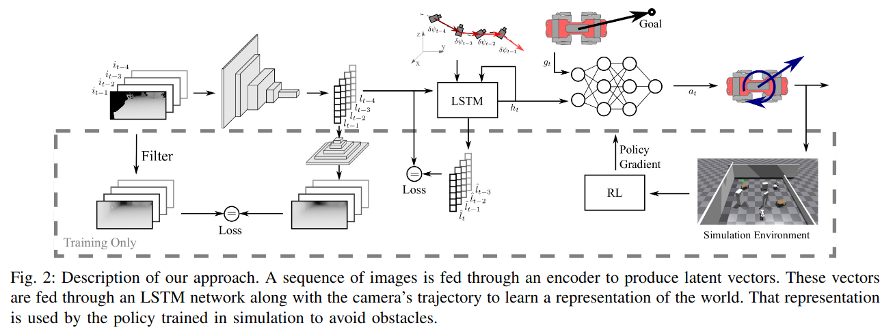
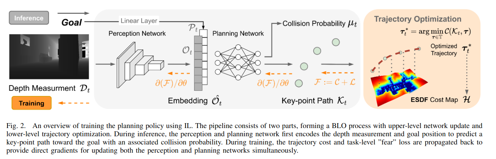
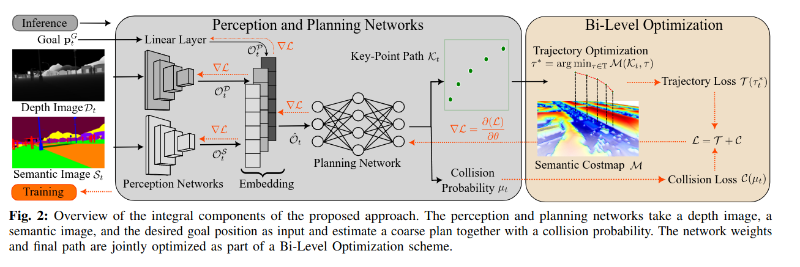

# Learning a State Representation and Navigation in Cluttered and Dynamic Environments

为了让网络学习滤波器的效果 用了一个vae结构 将过去几帧的图像过一个encoder 得到一个latent 然后过一个decoder 得到一个重构的图像 然后计算重构图像和被真实滤波器滤波的原图像作loss  训练强化学习的时候图像vae冻结  

encoder的输入 加上相机位置过LSTM 得到的hidden state 会过一个decoder去估计下一时刻的vae latent 与原latent作loss 这个hidden state 就作为状态表示和goal一起作为输入 让RL去学习 仿真环境为gym 奖励比较常规 但是depth image 用了仿真和真实数据 
LSTM也是一个ae结构 decoder 会同时估计过去的和未来的 过去的作loss 
# iPlanner: Imperative Path Planning  
RSS（2023）  
预先建高精度图的问题已经解决的比较好了  
传统规划方法：分层涉及到模块延迟的问题 而且效果层级制约  
端到端的方法（有标签）：label工作量大 依赖于数据集  
端到端（无标签）：RL带sensory后本身的采样慢 收敛慢 给一些额外先验或者辅助任务后又容易影响任务的收敛方向 

pipeline非常清晰 终点目标坐标过一个mlp 深度图过一个cnn（resnet）concat一下输入到planning network 得到一个n*3的路径点序列 这个序列会被TO优化 在每两个路径点中间作一个平滑查值后返回（可微分的）这个轨迹得到一个cost 加上任务级别的路径碰撞概率 作为整体的优化目标
##### LOSS 
障碍物cost 在欧几里德地图上计算  
与终点距离cost 在欧几里德地图上计算  
平滑cost 算每个路径点的经过时间
PLANNING NETWORK 还会预测一个路径碰撞概率 用二元交叉熵和真实碰撞概率对比 部署阶段只用这个概率<0.5的情况
这个仿真平台是用很多仿真图像和现实图像还原的

# ViPlanner: Visual Semantic Imperative Learning for Local Navigation
  
在Iplaner的基础上加入了语义图像 也是可微分的 一起训练 语义图像会被预处理   
Iplanner本质上训练用的是简化的立方体几何模型 这里使用了四足机器人 而且可以通行阶梯这种 （maybe因为语义信息） 但这几篇文章其实都没有考虑到机器人本身的动力学 就是作为一个移动agent 另外 和iplanner的区别是这里的运动用了RL模型 Iplanner是mpc viplanner可以在isaac lab上跑

# Learned Perceptive Forward Dynamics Model for Safe and Platform-aware Robotic Navigation
RSS 2025

考虑了机器人本体动力学　整体框架仍然是一个mpc的规划器　在给定机器人一个序列状态　和一个目标点的情况下规划出一条action　序列　（ＭＰＰＩ方式去规划 对规划出的不同序列计算　reward（非强化学习 可以理解为直接计算代价））　　
这个序列状态　设计了一个动力学模型去预测　在已知当前和历史状态的情况下预测未来状态　这个模型要提前利用仿真数据和现实数据训练 也就是说 用一个已经训练好的rl locomotion 模型去跑 然后预测出一个模型来 可以根据已有观测预测未来机器人的位置 成功率什么的 这个预测出来的状态序列作为mppi规划的参数   
然后得到一系列序列后 rl就可以跑了 部署
MPPI 输出的 a 就是机器人在下一个控制周期（论文里 0.5 s）要执行的一条 三维速度指令：
a = [v_x, v_y, ω_z]^T 

# TOP-Nav: Legged Navigation Integrating Terrain,Obstacle and Proprioception Estimation
RSS 2025  

下层用了rl的控制器 就是extreme parkour  
上层是一个计算代价的规划器 把视觉图像分块 计算障碍物成本 语义的地形可通过成本 以及下层控制器那个critic的运动成本也用上 把每一个patch的每一个成本都算出来 然后每规划一次都计算成本 然后随机采样点 选择最好的那个点 交给下层去做     
选出点后 交给rl去跑
#### 感觉和上一篇一样 其实都是考虑了机器人的动力学的感觉 上一篇考虑了成功率 用了一个正常的x y w的速度跟踪模型 这一篇则考虑的是critic的运动值 给一个yaw拿给extreme parkour去跑

# Learning Robust Autonomous Navigation and Locomotion for Wheeled-Legged Robots
ETH 2024 sci robotics    
重建高程图有延迟 所以高程图范围不能大  
任务:在一条预设的全局路径自主行驶 全局地图预先建好 在地图上随机标点 dij*规划一下 然后让机器人自主行驶 能达到一个长程导航的效果  

pipeline：整体是一个分层框架 上下层分开训练 先训底层 底层训练好后冻结训练上层  
上层规划器： 不显式输出规划的航点 而是直接输出有界速度命令（为此使用beta分布而非高斯分布）输入为高程图（利用相机和视觉建立的） 高程图两次历史 底层策略encoder出的隐藏状态 位置记忆缓冲区（预建图所以有世界坐标系下的访问位置（预先建好稠密点云 利用imu和编码器历史去匹配点云定位）和停留时间数） 航点与动作历史（保证平滑）  训练的时候随机采样目标点去跟踪
下层规划器： 来自22年sci robot的low level controler 用attention + RNN做的一个actor网络

# ANYmal Parkour: Learning Agile Navigation for Quadrupedal Robots

三个模块 感知模块 运动模块 导航模块   
运动模块训练五个策略 导航模块利用感知模块的向量选择要用的技能  
2m/s 在每个时间步能选择技能 

导航模块了解每种技能的能力和局限性 来调整轨迹？  
相当于建立一个概率函数 选择高概率的路径  
### perception module
用了深度摄像头和雷达获取点云信息 重建地形 附录里有一些点云的具体描述
六个realsense深度摄像头 和一个雷达 融合点  
具体的重建上离的近的地方高分辨率 远的地方低分辨率
### locomotion module
每个策略是单独训练的 用的是基于位置的命令 输入是goal position 以及到达需要的时间 接受的perception输入来自perception module的高程图
### navigation module
也是用强化学习训练的 训练的时候locomotion module全部冻结 最后得到一个每个动作的概率分布 最终部署的时候是选择最高概率  接受的perception输入来自perception module的体素地图

# some thinking
low-cost:eth那几篇导航 尤其是sci robot的 传感器用的太多了   
现在的训练方式往往是上下层分层 冻结起来
intergrating learning based locomotion part ：
下层能够传递地形感知进来   
也能传递本体状态（受力大小） robot-guide  
以及运动评分进来 -critic（甚至是部分评分）-multi critic

task:转角
全部观测可知 动力学模型可用 

# FrontierNet: Learning Visual Cues to Explore
we define a frontier as a region of free space that directly borders unexplored space  
紧邻未探索区域的自由空间区域 利用信息增益指标判断每个frontier增大探索空间的探索潜力  
预先建图去给模型去做监督  模型的值拿来做规划 可以最大化从一个未知环境不断探索frontier 直到获取整张地图  

#
frontier 定义为已知区域与未知区域之间的边界  
通过冻结视觉基础模型 训练decoder 得到每个frontier的可负担分数 然后纳入规划