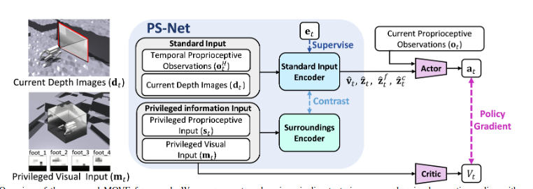
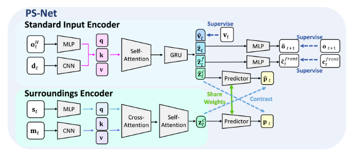
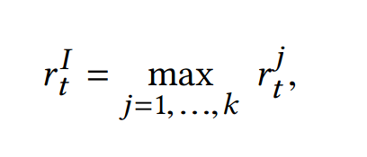
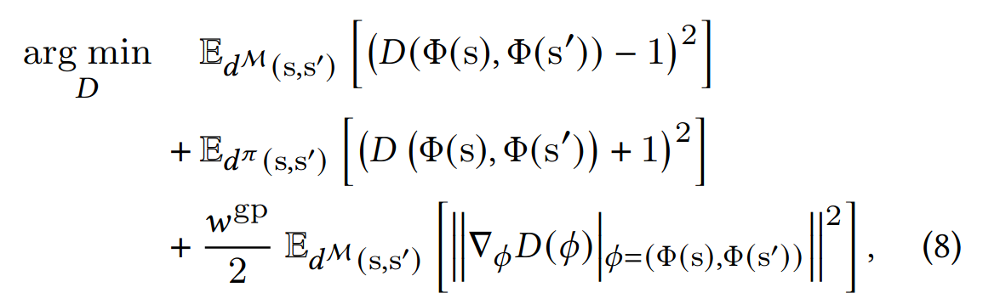
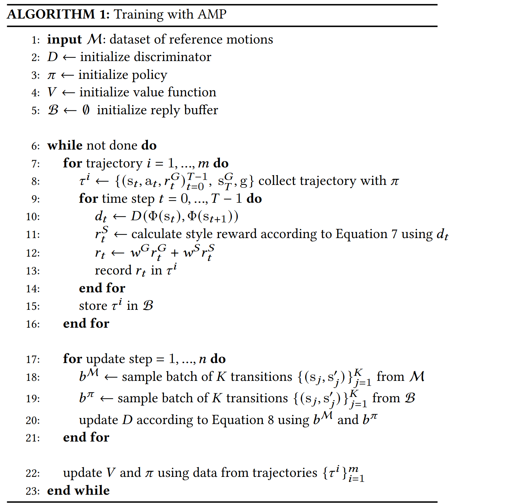

# RMA
(RSS 2021 )  
分层训练框架，思路是用历史信息估计环境变量  
第一层先训练一个base policy 和一个env factor encoder 用仿真中的环境信息作输入   
第二层冻结这个base policy 用历史状态训练一个adaptation module （CNN）第一层环境编码器输出的环境变量zt作监督学习  
#### （这个base policy在第二层是不会被改的）（他需要用这个base policy用适应模块的输出来采样得到轨迹，然后和groundtruth 也就是第一层的环境编码器来训练这个adapatation module）

# Teacher-student
reference:Learning Quadrupedal Locomotion over Challenging Terrain(ETH 2020 Science robotics)

也是分层训练框架 师生训练框架probably  
第一层用特权信息 训练一个mlp encoder 和机器人本体状态一起训练一个策略（TRPO）  
第二层用自身历史状态（TCN）训练环境估计器和student policy (用到了dagger 用学生策略rollout轨迹 然后老师策略输出来监督)
#### student policy在学生阶段是会更新的 teacher policy的输出起到监督作用 TCN Encoder也会随着更新

# Extreme parkour(CMU)
reference:Extreme Parkour with Legged Robots  

#### Teacher-student双阶段训练，而且训练用到了RMA框架（感觉RMA的核心就是用历史状态估计环境隐变量 history_latent->priv_latent）
### Teacher阶段：
在仿真环境中用深度图采样了132个点作为scandots的输入，通过一个scan_encoder输出为32 heading_yaw来自环境给定的2维 然后加上本体感知 59维 环境显式变量 9维度    
Estimator：输入为本体感知 59维度 输出为9维的环境显变量 （速度）在teacher中会训练 也一直作为环境显变量输入  
actor-critic_RMA:在teacher中隔几次会更新一次  adapatation module 也就是history_encoder 来模仿估计priv_encoder（RMA的核心）但在训的时候还是用priv_encoder
### Student阶段：
depth_encoder:backbone选择cnn，然后输出的特征向量与本体感觉再输入到GRU网络中 得到一个32+2的向量 32同scandots的输出 2为预测的heading_yaw  
此时用teacher的policy来对比 此时的teacher用history_encoder scan_encoder 得到teacher_action
student的观测略改 用预测的headingyaw 用depth_encoder的输出得到得到student_action 与teacher作loss 更新策略
### 同期的robot parkour则使用分阶段的软硬约束来做 分开训了六种策略并蒸馏到了一块
# Actuator net
refrerence:Learning Agile and Dynamic Motor Skills for Legged Robots（ETH sci. robot 2019）  
年代相对较早 locomotion的policy还比较简单  Actuator net的借鉴意义更大
  
##### 通过电机状态历史来估计状态  
收集一个数据集 包含位置误差 关节速度和力矩 通过生成足部轨迹 并用逆运动学求解，加入扰动，收集一个dataset监督学习
设计actuator net （MLP）在这个数据集上训练 最终预测扭矩

# Walk These Ways (MOB)
refrerence:Walk these Ways: Tuning Robot Control for Generalization with Multiplicity of Behavior (Corl 2022)    
8个行为参数 在代码中是15个command  通过人类手动调节实现不同地形的运动
observations 70 num_privileged_obs 2 num_observation_history 30  
没有用到teacher-student  
用了RMA 用历史估计特权信息 不过现有的特权信息只有两个维度 在平地上训练的

# Learning to walk in confined spaces using 3D representation
reference:Learning to walk in confined spaces using 3D representation (ETH ICRA 2024)
训练思路（在两个level端都用到了teacher-student去蒸馏 所以其实一共训了四个阶段）：  
low-level 强化学习训练给定6d命令情况下的鲁棒运动  
high-level 强化学习训练一个输出6d命令的策略 

#### 具体参数：
low-level-teacher:6d命令 本体感知：身体速度、方位、关节位置误差和速度的历史记录（在每个控制环之间堆叠几帧）、动作历史记录以及每条腿的相位 外部感知：腿部的高度场采样 特权信息：接触状态，接触力，接触法线，摩擦系数，大腿和柄接触状态，外部力量和扭矩施加到身体上以及挥杆相持续时间 动作空间：周期运动发生器的相位差 与关节位置残差    
high-level-teacher：本体感知：速度指令（3d速度命令）、身体速度、关节位置、关节速度、身体方向和之前的动作 外部感知同low-level 再加上一个球形感知 输出：3d速度的残差（跳过学习阶段）和滚动角 俯仰角 身体高度
high-level-stuent: 文中说可以用相机 也可以用雷达 去恢复体素信息

# Learning Multiple Gaits within Latent Space for Quadruped Robots
reference: Learning Multiple Gaits within Latent Space for Quadruped Robots(没看出来publish在哪了)
  
步态设计参考walk these ways 
用到了类似AMP的模仿学习 看不懂 ...   
不过他在复杂地形中训练了  所以性能强过仅在平坦地形下训练的walktheseways
（不过还是个盲狗）

# Dreamwaq 
   
reference:DreamWaQ: Learning Robust Quadrupedal Locomotion With Implicit
Terrain Imagination via Deep Reinforcement Learning(ICRA 2023)  
#### 采用非对称的actor-critic网络 
actor:输入为 本体感知ot context-aided estimator 估计出的身体速度vt和隐藏变量z  
    
critic:输入为 特权信息 st = [ot vt dt ht] dt为身体受到的力 ht为扫描的高度图信息
reward沿用之前的 
#### context-aided estimator
   
与之前直接估计机器人状态的estimator不同 他这个用ot历史同时估计机器人速度并推断环境信息 VAE结构 但部署的时候只有第一个mlp 第二个decoder应该是为了提取隐性特征算loss？ 
LCE(总损失) = Lest + LVAE,   
Lest = MSE(˜vt, vt)  
LVAE = M SE(˜ot+1, ot+1) + βDKL(q(zt|oH
t ) ‖ p(zt)),

总结：非对称的actor-critic critic网络里输入的是特权信息 那么预测的也是特权信息反馈的状态价值，actor则用非特权信息与上下文估计器训练，这样就可以让actor隐式的利用他没有输入 但是critic输入了的特权信息，来作出运动决策。

# Dreamwaq with depth images
reference:PIE: Parkour with Implicit-Explicit Learning
Framework for Legged Robots(RAL 2024)    
   
和dreamwaq思路一模一样 加上了视觉信息做跑酷 视觉图片是一个2帧的buffer 为了和状态历史一起输入 使用了transformer捕捉特征 用GRU保存历史信息   
#### 核心创新点就是这个estimator 和CENets 类似的VAE结构 loss也类似 mse加上kl散度 

# MOVE
reference:MOVE: Multi-skill Omnidirectional Legged Locomotion with Limited View in 3D Environments(ICRA 2025)   
感觉是PIE++ 训练有点复杂....
 
 

# DeepMimic
reference:DeepMimic: Example-Guided Deep Reinforcement Learning of Physics-Based Character Skills(2018年的文章 对后续的AWP等模仿学习都有参考意义)  
overview:使用基于ppo的强化学习策略，control policy π (at|st,gt) , gt为任务目标，at为目标位置，通过PD控制，奖励函数定义为模仿奖励和任务奖励。  
control policy π 为两层全连接 1024*512 使用relu激活 价值网络隐藏层数相同  
（对于带视觉的网络 则在全连接前加入卷积网路）
#### 奖励设计
     
rIt为模仿策略 rGt为任务策略   
     
模仿策略可以被分为与参考轨迹的位置差 速度差 末端执行器位置差和质心差
#### RSI(初始状态分布采样自参考轨迹而非固定) 
能够帮助策略了解什么状态下的回报比较高 进而指导策略更新 （传统RL因为没有参考轨迹 所以初始状态是固定的 以后空翻为例 策略很难知道翻起来的回报高 但RSI直接将状态初始化为空中 策略就可以收到高回报进而梯度更新）
#### Early Termination
将无限长度的MDP过程通过设置终止条件提前终止（目前已经很普遍了 这个方式）  
#### 在这篇文章中 为了模仿特定的clip 策略中包括一项相位信息 来表示时间的相对关系
#### Multi 前面介绍的都是从单个参考轨迹中学习 现在介绍多个参考轨迹学习
Multi-Clip Reward：为策略提供多个参考轨迹剪辑，实验验证虽然这个公式简单，但是是有效的，但是仅对比较相似的参考轨迹剪辑有效，如向前走 向右转。
   
Skill Selector:训练一个策略同时模仿一组不同的技能，在不同时间使用不同剪辑。放弃人物目标奖励，只训练模仿目标奖励，训练的时候对不同的模仿目标随机采样。然后play的时候由用户手动指定。让用户指定的方法就是将动作编成一个one-hot码，和前文中的goal一起输入网络（对同一类运动的具体效果进行选择，比如对于翻转，可以选择：向前翻转、向后翻转、左侧翻转、右侧翻转等）  
Composite Policy:训练不同的策略执行不同技能 然后集成到一个复合策略中 通过价值函数确定给定状态下最合适的技能 使用波尔兹曼分布构造复合策略  在每个周期开始时，从复合策略中采样新技能，并在选择新技能之前执行所选技能一个完整的周期。为了防止角色重复执行相同的技能，该策略被限制为从不连续对相同的技能进行采样.  
在训练时每种动作分别训练，训练结束执行时则根据每种动作所对应的输出的value network返回值确定当前state下哪一种动作被使用。（可以从不同类别运动的动作中进行选择 ，做出最符合 t tt时刻状态的动作 a t a_tat，以便更好地适应新的环境和任务。）

# AMP
区别于deepmimic的模仿 AMP学习的是风格 判别器不考虑动作 仅考虑状态的转移来判断是否基于参考轨迹 GAIL+PPO
#### 奖励设计
r (st , at , st+1, g) = wG rG  (st , at , st , g) +  wS rS (st , st+1) 即目标奖励和风格奖励  
训练判别器 采用最小二乘GAN  又考虑到GAN本身训练的不稳定性 加入梯度惩罚项 判别器D的更新方式为  
 
并将RL奖励设计为r (st , st+1) = max 0, 1 − 0.25(D (st , st+1) − 1)2 . （Equation 7）
#### 训练细节
actor network 1024*512全连接层 输出的动作的高斯分布方差是手动指定的 value network与判别器也为类似架构
#### 伪代码
 
#### SUMMARY
AMP其实主要也只是针对单个参考轨迹进行学习，如果学习的轨迹较多，可能只能学到一部分。  
由于没有相位变量的存在，AMP学习出来的策略并不严格跟随参考轨迹，但学习出来的性能仍然很好，而且也让AMP能够更好的处理复杂任务。（后面ETH出了一篇基于AMP的文章 Multi-AMP 就是让一个策略先后学习多个参考轨迹了 通过对参考轨迹采样的方式来选择 ）

## VBC(visual-whole-body-control)

## Quarduped VLA
reference:QUAR-VLA: Vision-Language-Action Model for Quadruped Robots(ICCV 2023 )
自己构建了数据集，涉及了很多任务(基础感知 goto somewhere 的导航 如卸载背上东西的规划 避障 但没有涉及复杂地形)（多任务 真机数据 模拟数据 很多篇幅在讲这些）  
VLA的训练架构按照RT1的（这里放RT1的训练框架 比较直观） 一个预先训练的视觉语言模型 将里面的 输出的也不是电机指令 是11维度的命令 再喂给端到端的强化学习控制器 这里用了mob的

主要两个点：VLM里提取的token会通过一个tokenlearner 压缩维度 然后后面加上位置信息 我们把电机认为是一个一个相互有关系的token 所以会用到mask计算loss  
类比nlp 生成字是一个字典 找最大概率字的过程 电机的连续值会导致无穷大的字典 所以把电机值分为256个离散的桶 来计算每个桶的概率 用交叉熵作loss 当然 最后传给电机的时候还要作逆离散化
 
# VBC(visual-whole-body-control)

# LLM for quadruped 
llm修改奖励函数  
llm给出 每只脚什么时间与地面接触什么时间抬起  
llm加一些先验知识 给出目标电机位置
nvidia-smi
# AUTO_MOB
  

## Tricks in reinforce learining
### Improving Generalization in Visual Reinforcement Learning via Conflict-aware Gradient Agreement Augmentation
为了减轻在不同数据上训练的梯度冲突 提出了一种对梯度作优化的方式 一种数学优化方法