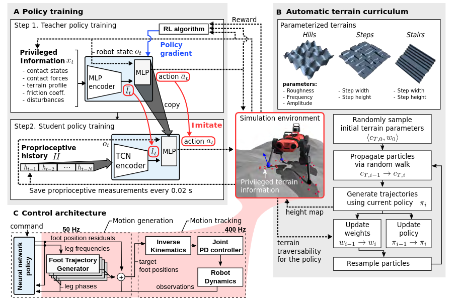
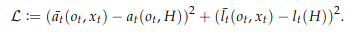
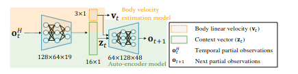
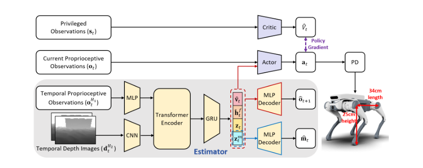
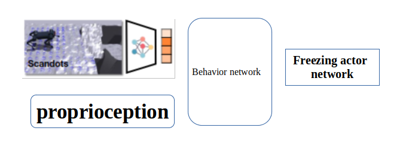

# RMA
(RSS 2021 )  
分层训练框架，思路是用历史信息估计环境变量  
第一层先训练一个base policy 和一个env factor encoder 用仿真中的环境信息作输入   
第二层冻结这个base policy 用历史状态训练一个adaptation module （CNN）第一层环境编码器输出的环境变量zt作监督学习  
#### （这个base policy在第二层是不会被改的）（他需要用这个base policy用适应模块的输出来采样得到轨迹，然后和groundtruth 也就是第一层的环境编码器来训练这个adapatation module）

# Teacher-student
reference:Learning Quadrupedal Locomotion over Challenging Terrain(ETH 2020 Science robotics)

也是分层训练框架 师生训练框架probably  
第一层用特权信息 训练一个mlp encoder 和机器人本体状态一起训练一个策略（TRPO）  
第二层用自身历史状态（TCN）训练环境估计器和student policy (用到了dagger 用学生策略rollout轨迹 然后老师策略输出来监督)
#### student policy在学生阶段是会更新的 teacher policy的输出起到监督作用 TCN Encoder也会随着更新

# Extreme parkour(CMU)
reference:Extreme Parkour with Legged Robots  

#### Teacher-student双阶段训练，而且训练用到了RMA框架（感觉RMA的核心就是用历史状态估计环境隐变量 history_latent->priv_latent）
### Teacher阶段：
在仿真环境中用深度图采样了132个点作为scandots的输入，通过一个scan_encoder输出为32 heading_yaw来自环境给定的2维 然后加上本体感知 59维 环境显式变量 9维度    
Estimator：输入为本体感知 59维度 输出为9维的环境显变量 （速度）在teacher中会训练 也一直作为环境显变量输入  
actor-critic_RMA:在teacher中隔几次会更新一次  adapatation module 也就是history_encoder 来模仿估计priv_encoder（RMA的核心）但在训的时候还是用priv_encoder
### Student阶段：
depth_encoder:backbone选择cnn，然后输出的特征向量与本体感觉再输入到GRU网络中 得到一个32+2的向量 32同scandots的输出 2为预测的heading_yaw  
此时用teacher的policy来对比 此时的teacher用history_encoder scan_encoder 得到teacher_action
student的观测略改 用预测的headingyaw 用depth_encoder的输出得到得到student_action 与teacher作loss 更新策略

# Actuator net
refrerence:Learning Agile and Dynamic Motor Skills for Legged Robots（ETH sci. robot 2019）  
年代相对较早 locomotion的policy还比较简单  Actuator net的借鉴意义更大
  
通过电机状态历史来估计状态  
收集一个数据集 包含位置误差 关节速度和力矩 通过生成足部轨迹 并用逆运动学求解，加入扰动，收集一个dataset监督学习
设计actuator net （MLP）在这个数据集上训练 最终预测扭矩

# Walk These Ways (MOB)
refrerence:Walk these Ways: Tuning Robot Control for Generalization with Multiplicity of Behavior (Corl 2022)    
8个行为参数 在代码中是15个command  通过人类手动调节实现不同地形的运动
observations 70 num_privileged_obs 2 num_observation_history 30  
没有用到teacher-student  
用了RMA 用历史估计特权信息 不过现有的特权信息只有两个维度 在平地上训练的

# Learning to walk in confined spaces using 3D representation
reference:Learning to walk in confined spaces using 3D representation (ETH ICRA 2024)
训练思路（在两个level端都用到了teacher-student去蒸馏 所以其实一共训了四个阶段）：  
low-level 强化学习训练给定6d命令情况下的鲁棒运动  
high-level 强化学习训练一个输出6d命令的策略 

#### 具体参数：
low-level-teacher:6d命令 本体感知：身体速度、方位、关节位置误差和速度的历史记录（在每个控制环之间堆叠几帧）、动作历史记录以及每条腿的相位 外部感知：腿部的高度场采样 特权信息：接触状态，接触力，接触法线，摩擦系数，大腿和柄接触状态，外部力量和扭矩施加到身体上以及挥杆相持续时间 动作空间：周期运动发生器的相位差 与关节位置残差    
high-level-teacher：本体感知：速度指令（3d速度命令）、身体速度、关节位置、关节速度、身体方向和之前的动作 外部感知同low-level 再加上一个球形感知 输出：3d速度的残差（跳过学习阶段）和滚动角 俯仰角 身体高度
high-level-stuent: 文中说可以用相机 也可以用雷达 去恢复体素信息

# Learning Multiple Gaits within Latent Space for Quadruped Robots
reference: Learning Multiple Gaits within Latent Space for Quadruped Robots(没看出来publish在哪了)
  
步态设计参考walk these ways 
用到了类似AMP的模仿学习 看不懂 ...   
不过他在复杂地形中训练了  所以性能强过仅在平坦地形下训练的walktheseways
（不过还是个盲狗）

# Dreamwaq 
 
reference:DreamWaQ: Learning Robust Quadrupedal Locomotion With Implicit
Terrain Imagination via Deep Reinforcement Learning(ICRA 2023)  
#### 采用非对称的actor-critic网络 
actor:输入为 本体感知ot context-aided estimator 估计出的身体速度vt和隐藏变量z  
    
critic:输入为 特权信息 st = [ot vt dt ht] dt为身体受到的力 ht为扫描的高度图信息
reward沿用之前的 
#### context-aided estimator
   
与之前直接估计机器人状态的estimator不同 他这个用ot历史同时估计机器人速度并推断环境信息 VAE结构 但部署的时候只有第一个mlp 第二个decoder应该是为了提取隐性特征算loss？ 
LCE(总损失) = Lest + LVAE,   
Lest = MSE(˜vt, vt)  
LVAE = M SE(˜ot+1, ot+1) + βDKL(q(zt|oH
t ) ‖ p(zt)),

总结：非对称的actor-critic critic网络里输入的是特权信息 那么预测的也是特权信息反馈的状态价值，actor则用非特权信息与上下文估计器训练，这样就可以让actor隐式的利用他没有输入 但是critic输入了的特权信息，来作出运动决策。

# Dreamwaq with depth images
reference:PIE: Parkour with Implicit-Explicit Learning
Framework for Legged Robots(RAL 2024)  
 
和dreamwaq思路一模一样 加上了视觉信息做跑酷 视觉图片是一个2帧的buffer 为了和状态历史一起输入 使用了transformer捕捉特征 用GRU保存历史信息   
#### 核心创新点就是这个estimator 和CENets 类似的VAE结构 loss也类似 mse加上kl散度 

## AMP

## VBC(visual-whole-body-control)

# LLM for quadruped 
llm修改奖励函数  
llm给出 每只脚什么时间与地面接触什么时间抬起  
llm加一些先验知识 给出目标电机位置

## AUTO_MOB
  