# RMA
(RSS 2021 )  
分层训练框架，思路是用历史信息估计环境变量  
第一层先训练一个base policy 和一个env factor encoder 用仿真中的环境信息作输入   
第二层冻结这个base policy 用历史状态训练一个adaptation module （CNN）第一层环境编码器输出的环境变量zt作监督学习  
#### （这个base policy在第二层是不会被改的）（他需要用这个base policy用适应模块的输出来采样得到轨迹，然后和groundtruth 也就是第一层的环境编码器来训练这个adapatation module）
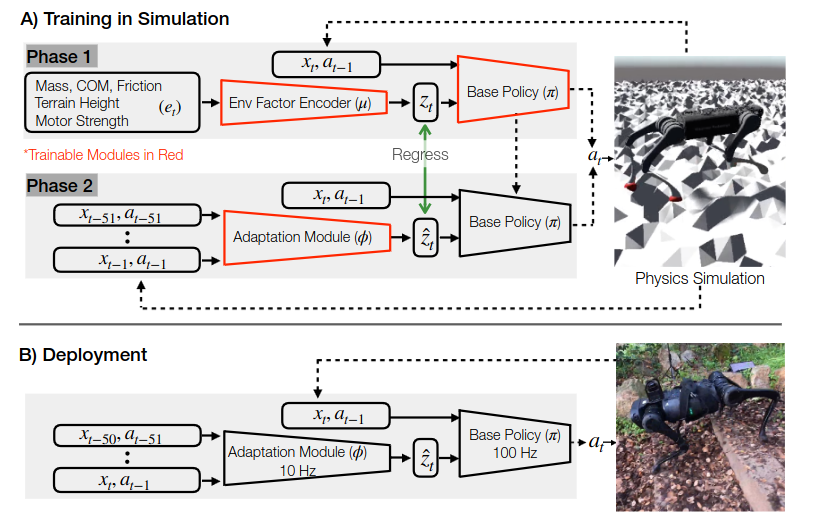

# Teacher-student
reference:Learning Quadrupedal Locomotion over Challenging Terrain(ETH 2020 Science robotics)

也是分层训练框架 师生训练框架probably  
第一层用特权信息 训练一个mlp encoder 和机器人本体状态一起训练一个策略（TRPO）  
第二层用自身历史状态（TCN）训练环境估计器和student policy (用到了dagger 用学生策略rollout轨迹 然后老师策略输出来监督)
#### student policy在学生阶段是会更新的 teacher policy的输出起到监督作用 TCN Encoder也会随着更新


# MTAC
reference：MTAC: Hierarchical Reinforcement Learning-based Multi-gait Terrain-adaptive Quadruped Controller （ICRA 2024）
分层控制 下层训了三个不同的策略 上层寻一个high policy （DRL）来选用哪个策略合适

# ANYmal Parkour
reference:ANYmal Parkour: Learning Agile Navigation for Quadrupedal Robots (ETH 2023 Science robotics)
## 简介
三个模块 感知模块 运动模块 导航模块   
运动模块训练五个策略 导航模块利用感知模块的向量选择要用的技能  
2m/s 在每个时间步能选择技能

导航模块了解每种技能的能力和局限性 来调整轨迹？  
相当于建立一个概率函数 选择高概率的路径  
## perception module
用了深度摄像头和雷达获取点云信息 重建地形 附录里有一些点云的具体描述
六个realsense深度摄像头 和一个雷达 融合点  
具体的重建上离的近的地方高分辨率 远的地方低分辨率
## locomotion module
每个策略是单独训练的 用的是基于位置的命令
## navigation module
也是用强化学习训练的 最后得到一个每个动作的概率分布 最终部署的时候是选择最高概率

# Extreme parkour(CMU)
reference:Extreme Parkour with Legged Robots  
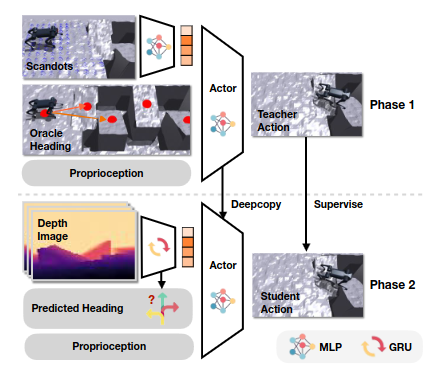
#### Teacher-student双阶段训练，而且训练用到了RMA框架（感觉RMA的核心就是用历史状态估计环境隐变量 history_latent->priv_latent）
### Teacher阶段：
在仿真环境中用深度图采样了132个点作为scandots的输入，通过一个scan_encoder输出为32 heading_yaw来自环境给定的2维 然后加上本体感知 59维 环境显式变量 9维度    
Estimator：输入为本体感知 59维度 输出为9维的环境显变量 （速度）在teacher中会训练 也一直作为环境显变量输入  
actor-critic_RMA:在teacher中隔几次会更新一次  adapatation module 也就是history_encoder 来模仿估计priv_encoder（RMA的核心）但在训的时候还是用priv_encoder
### Student阶段：
depth_encoder:backbone选择cnn，然后输出的特征向量与本体感觉再输入到GRU网络中 得到一个32+2的向量 32同scandots的输出 2为预测的heading_yaw  
此时用teacher的policy来对比 此时的teacher用history_encoder scan_encoder 得到teacher_action
student的观测略改 用预测的headingyaw 用depth_encoder的输出得到得到student_action 与teacher作loss 更新策略
### 同期的robot parkour则使用分阶段的软硬约束来做 分开训了六种策略并蒸馏到了一块
# Actuator net
refrerence:Learning Agile and Dynamic Motor Skills for Legged Robots（ETH sci. robot 2019）  

年代相对较早 locomotion的policy还比较简单  Actuator net的借鉴意义更大  

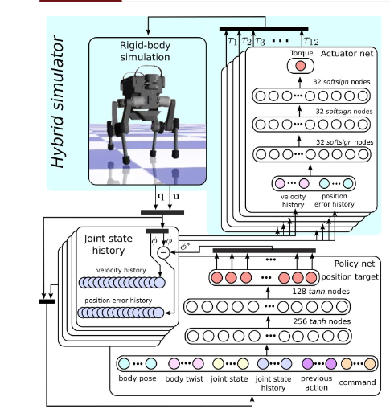  
##### 通过电机状态历史来估计状态  
收集一个数据集 包含位置误差 关节速度和力矩 通过生成足部轨迹 并用逆运动学求解，加入扰动，收集一个dataset监督学习
设计actuator net （MLP）在这个数据集上训练 最终预测扭矩

# Walk These Ways (MOB)
refrerence:Walk these Ways: Tuning Robot Control for Generalization with Multiplicity of Behavior (Corl 2022)    
8个行为参数 在代码中是15个command  通过人类手动调节实现不同地形的运动
observations 70 num_privileged_obs 2 num_observation_history 30  
没有用到teacher-student  
用了RMA 用历史估计特权信息 不过现有的特权信息只有两个维度 在平地上训练的

# Learning to walk in confined spaces using 3D representation
reference:Learning to walk in confined spaces using 3D representation (ETH ICRA 2024)
训练思路（在两个level端都用到了teacher-student去蒸馏 所以其实一共训了四个阶段）：  
low-level 强化学习训练给定6d命令情况下的鲁棒运动  
high-level 强化学习训练一个输出6d命令的策略 
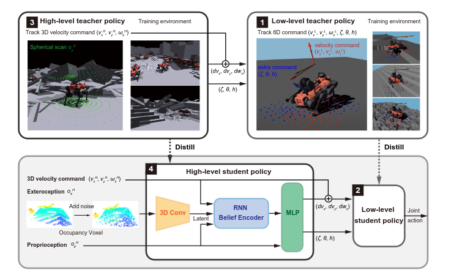
#### 具体参数：
low-level-teacher:6d命令 本体感知：身体速度、方位、关节位置误差和速度的历史记录（在每个控制环之间堆叠几帧）、动作历史记录以及每条腿的相位 外部感知：腿部的高度场采样 特权信息：接触状态，接触力，接触法线，摩擦系数，大腿和柄接触状态，外部力量和扭矩施加到身体上以及挥杆相持续时间 动作空间：周期运动发生器的相位差 与关节位置残差    
high-level-teacher：本体感知：速度指令（3d速度命令）、身体速度、关节位置、关节速度、身体方向和之前的动作 外部感知同low-level 再加上一个球形感知 输出：3d速度的残差（跳过学习阶段）和滚动角 俯仰角 身体高度
high-level-stuent: 文中说可以用相机 也可以用雷达 去恢复体素信息

# Learning Multiple Gaits within Latent Space for Quadruped Robots
reference: Learning Multiple Gaits within Latent Space for Quadruped Robots(没看出来publish在哪了)
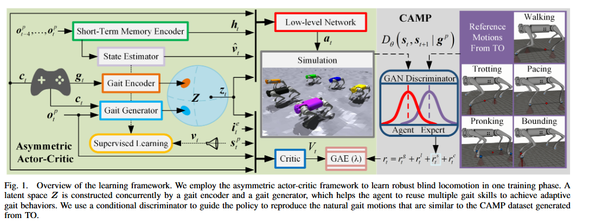  
步态设计参考walk these ways    
不过他在复杂地形中训练了  所以性能强过仅在平坦地形下训练的walktheseways

### 核心组件 Gait Encoder 和Gait Generator 两者同时训练
#### Gait Encoder：把步态信息，身体高度，频率等八个参数作为信息 交给Gait Encoder编码成隐变量 归一化后变成一个特征空间 这个特征空间会作为下层强化学习的部分输入
####  Gait Generator：输入为自身状态和命令，输出被强制和Gait Encoder对齐 也就是说 Gait Generator的生成和Gait Encoder是在同一个空间下的 可以理解为让Generator学习去生成和固定步态一样的 
在具体训练时 分为两个组   
Gait Encoder 输入为固定步态参数 在平地训练 且在训练时添加AMP的先验奖励与步态的强制奖励 AMP的dataset为不同的固定步态参数的组合 
Gait Generator 输入仅为本体状态和速度 在复杂地形上训练 没有AMP和步态强制奖励 也就是说 他鼓励Generator去探索适合的步态隐藏变量 由于限制在统一特征空间下 又能自己探索 实现去学习生成和固定步态类似的特征  （就像是在参考Gait Encoder并在他的基础上自行探索的感觉 很好的思路 而且能防止学崩溃）
（不过还是个盲狗）

# PAS 模拟概率退火
reference:SARO: Space-Aware Robot System for Terrain Crossing via Vision-Language Model  
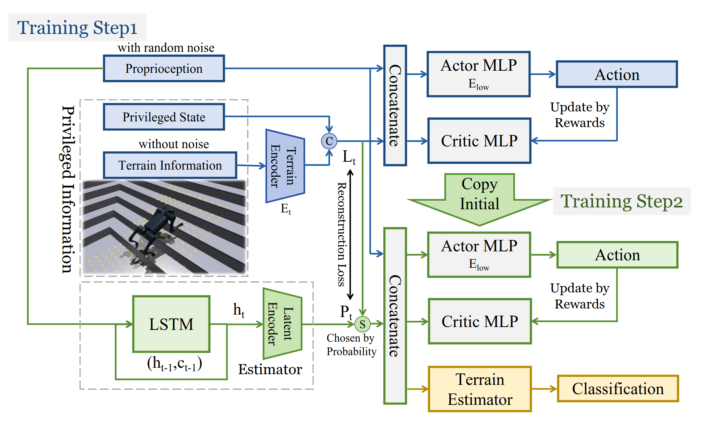 
### 第一阶段
特权信息4维 环境采样点187个 encode为32维 构成一个36维的隐变量 本体状态45维共同作为obs输入到PPO里 做强化学习  
### 第二阶段
本体状态的45维度在过一个LSTM和MLP后对齐为一个36维度的隐藏变量 使用模拟概率退火（概率性选择用一阶段的latent还是这里的latent） 
# Dreamwaq 
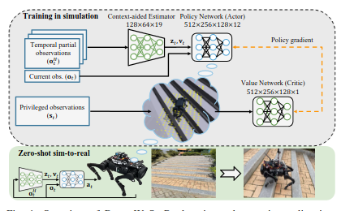   
reference:DreamWaQ: Learning Robust Quadrupedal Locomotion With Implicit
Terrain Imagination via Deep Reinforcement Learning(ICRA 2023)  
#### 采用非对称的actor-critic网络 
actor:输入为 本体感知ot context-aided estimator 估计出的身体速度vt和隐藏变量z  
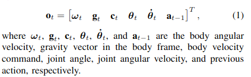    
critic:输入为 特权信息 st = [ot vt dt ht] dt为身体受到的力 ht为扫描的高度图信息
reward沿用之前的 
#### context-aided estimator
   
与之前直接估计机器人状态的estimator不同 他这个用ot历史同时估计机器人速度并推断环境信息 VAE结构 但部署的时候只有第一个mlp 第二个decoder应该是为了提取隐性特征算loss？ 
LCE(总损失) = Lest + LVAE,   
Lest = MSE(˜vt, vt)  
LVAE = M SE(˜ot+1, ot+1) + βDKL(q(zt|oH
t ) ‖ p(zt)),

总结：非对称的actor-critic critic网络里输入的是特权信息 那么预测的也是特权信息反馈的状态价值，actor则用非特权信息与上下文估计器训练，这样就可以让actor隐式的利用他没有输入 但是critic输入了的特权信息，来作出运动决策。

# Dreamwaq with depth images
reference:PIE: Parkour with Implicit-Explicit Learning
Framework for Legged Robots(RAL 2024)    
   
和dreamwaq思路一模一样 加上了视觉信息做跑酷 视觉图片是一个2帧的buffer 为了和状态历史一起输入 使用了transformer捕捉特征 用GRU保存历史信息   
#### 核心创新点就是这个estimator 和CENets 类似的VAE结构 loss也类似 mse加上kl散度 

# MOVE
reference:MOVE: Multi-skill Omnidirectional Legged Locomotion with Limited View in 3D Environments(ICRA 2025)     
感觉是PIE++ 训练有点复杂....  

  


# Himloco
reference:HYBRID INTERNAL MODEL: LEARNING AGILE LEGGED LOCOMOTION WITH SIMULATED ROBOT RESPONSE(ICLR), 2024
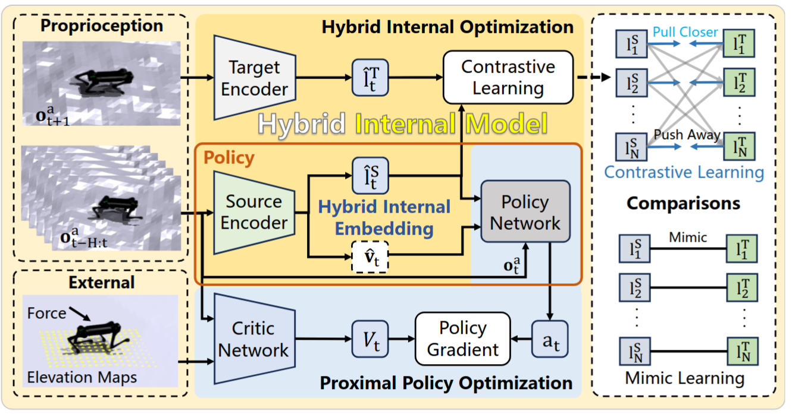  
感觉IMC是一个幌子 主要还是用了对比学习来取代历史状态预测的环境信息与ground truth的mse  
对比学习用的是swav 因为MOVE也用到了对比学习 可以大概总结一下
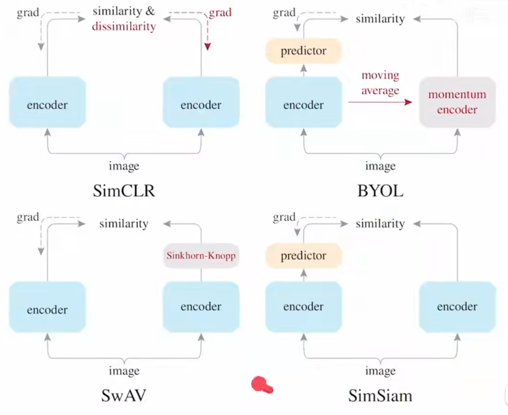 

# PIM
在人形上 加了lidar（用了FAST-LIO来恢复地面高度场）来做percepetion 没有用深度图 主要的思想是采样高度图 并用dreamwaq思路 在perception 预测module中 添加了采样点信息
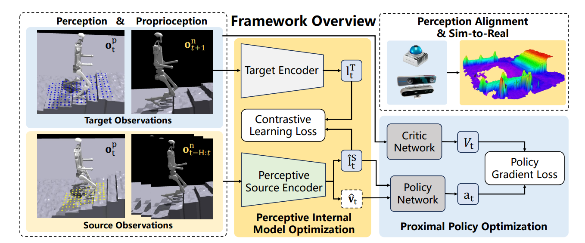 

# DeepMimic
reference:DeepMimic: Example-Guided Deep Reinforcement Learning of Physics-Based Character Skills(2018年的文章 对后续的AWP等模仿学习都有参考意义)  
overview:使用基于ppo的强化学习策略，control policy π (at|st,gt) , gt为任务目标，at为目标位置，通过PD控制，奖励函数定义为模仿奖励和任务奖励。  
control policy π 为两层全连接 1024*512 使用relu激活 价值网络隐藏层数相同  
（对于带视觉的网络 则在全连接前加入卷积网路）
#### 奖励设计
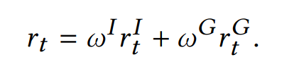     
r<sup>I</sup><sub>t</sub>为模仿策略 r<sup>G</sup><sub>t</sub>为任务策略   
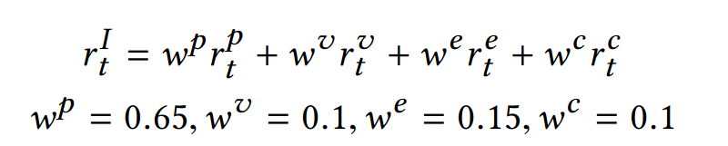     
模仿策略可以被分为与参考轨迹的位置差 速度差 末端执行器位置差和质心差
#### RSI(初始状态分布采样自参考轨迹而非固定) 
能够帮助策略了解什么状态下的回报比较高 进而指导策略更新 （传统RL因为没有参考轨迹 所以初始状态是固定的 以后空翻为例 策略很难知道翻起来的回报高 但RSI直接将状态初始化为空中 策略就可以收到高回报进而梯度更新）
#### Early Termination
将无限长度的MDP过程通过设置终止条件提前终止（目前已经很普遍了 这个方式）  
#### 在这篇文章中 为了模仿特定的clip 策略中包括一项相位信息 来表示时间的相对关系
#### Multi 前面介绍的都是从单个参考轨迹中学习 现在介绍多个参考轨迹学习
Multi-Clip Reward：为策略提供多个参考轨迹剪辑，实验验证虽然这个公式简单，但是是有效的，但是仅对比较相似的参考轨迹剪辑有效，如向前走 向右转。
   
Skill Selector:训练一个策略同时模仿一组不同的技能，在不同时间使用不同剪辑。放弃人物目标奖励，只训练模仿目标奖励，训练的时候对不同的模仿目标随机采样。然后play的时候由用户手动指定。让用户指定的方法就是将动作编成一个one-hot码，和前文中的goal一起输入网络（对同一类运动的具体效果进行选择，比如对于翻转，可以选择：向前翻转、向后翻转、左侧翻转、右侧翻转等）  
Composite Policy:训练不同的策略执行不同技能 然后集成到一个复合策略中 通过价值函数确定给定状态下最合适的技能 使用波尔兹曼分布构造复合策略  在每个周期开始时，从复合策略中采样新技能，并在选择新技能之前执行所选技能一个完整的周期。为了防止角色重复执行相同的技能，该策略被限制为从不连续对相同的技能进行采样.  
在训练时每种动作分别训练，训练结束执行时则根据每种动作所对应的输出的value network返回值确定当前state下哪一种动作被使用。（可以从不同类别运动的动作中进行选择 ，做出最符合 t tt时刻状态的动作 a t a_tat，以便更好地适应新的环境和任务。）

# AMP
区别于deepmimic的模仿 AMP学习的是风格 判别器不考虑动作 仅考虑状态的转移来判断是否基于参考轨迹 GAIL+PPO
#### 奖励设计
r (st , at , st+1, g) = w<sup>G</sup> r<sup>G</sup>  (st , at , st , g) +  w<sup>S</sup> r<sup>S</sup> (st , st+1) 即目标奖励和风格奖励  
训练判别器 采用最小二乘GAN  又考虑到GAN本身训练的不稳定性 加入梯度惩罚项 判别器D的更新方式为  
 
并将RL奖励设计为r (st , st+1) = max 0, 1 − 0.25(D (st , st+1) − 1)<sup>2</sup> . （Equation 7）
#### 训练细节
actor network 1024*512全连接层 输出的动作的高斯分布方差是手动指定的 value network与判别器也为类似架构
#### 伪代码
 
#### SUMMARY
AMP其实主要也只是针对单个参考轨迹进行学习，如果学习的轨迹较多，可能只能学到一部分。  
由于没有相位变量的存在，AMP学习出来的策略并不严格跟随参考轨迹，但学习出来的性能仍然很好，而且也让AMP能够更好的处理复杂任务。（后面ETH出了一篇基于AMP的文章 Multi-AMP 就是让一个策略先后学习多个参考轨迹了 通过对参考轨迹采样的方式来选择 ）


# Quarduped VLA
reference:QUAR-VLA: Vision-Language-Action Model for Quadruped Robots(ICCV 2023 )
自己构建了数据集，涉及了很多任务(基础感知 goto somewhere 的导航 如卸载背上东西的规划 避障 但没有涉及复杂地形)（多任务 真机数据 模拟数据 很多篇幅在讲这些）  
VLA的训练架构按照RT1的（这里放RT1的训练框架 比较直观） 一个预先训练的视觉语言模型 将里面的 输出的也不是电机指令 是11维度的命令 再喂给端到端的强化学习控制器 这里用了mob的
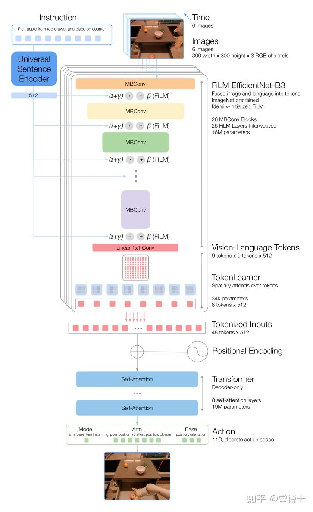  
主要两个点：VLM里提取的token会通过一个tokenlearner 压缩维度 然后后面加上位置信息 我们把电机认为是一个一个相互有关系的token 所以会用到mask计算loss  
类比nlp 生成字是一个字典 找最大概率字的过程 电机的连续值会导致无穷大的字典 所以把电机值分为256个离散的桶 来计算每个桶的概率 用交叉熵作loss 当然 最后传给电机的时候还要作逆离散化

# Deep Whole-body-control
reference:Deep Whole-Body Control: Learning a Unified Policy for Manipulation and Locomotion(CORL 2022)

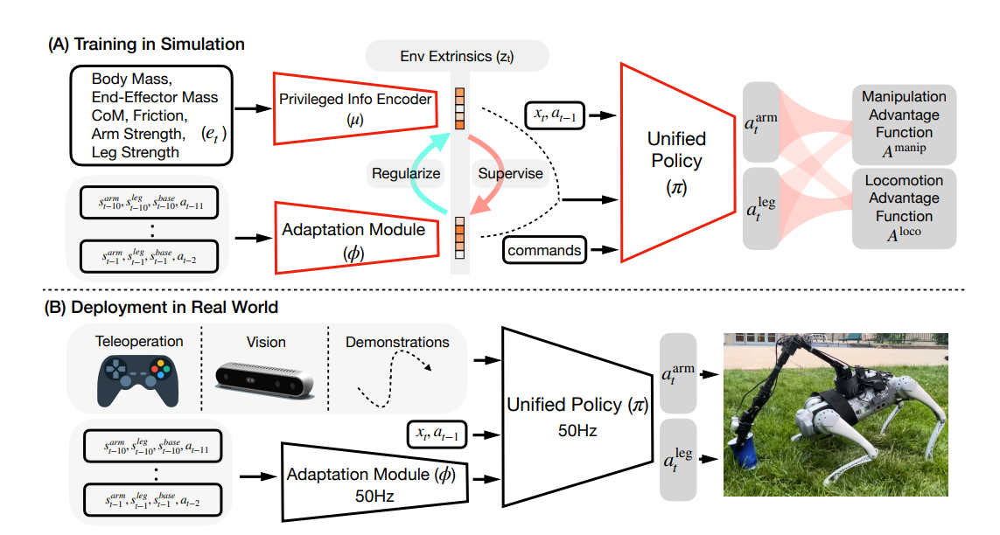  
PPO 但是给arm和leg分别搞了自己的actor和critic网络 两阶段训练 手臂的轨迹是随机采样的 给定一个目标位置 然后插值 带一个轨迹时间 没有用到视觉
### ppo loss 设计
既然有两个actor网络 那么优势函数就得合并   
相对于策略参数θπ的训练目标是：
$$ J(\theta_\pi) = \frac{1}{|D|} \sum_{(s_t, a_t) \in D} \log \pi(a_{\text{arm}_t} | s_t) (A_{\text{manip}} + \beta A_{\text{loco}}) + \log \pi(a_{\text{leg}_t} | s_t) (\beta A_{\text{manip}} + A_{\text{loco}}) $$
其中，β是课程参数，它从0线性增加到1，跨越时间步Tmix：β = min(t/Tmix, 1)。Amanip和Aloco分别是基于rmanip和rloco的优势函数。直观地，优势混合通过首先将操控回报的差异归因于手臂动作，将运动回报的差异归因于腿部动作，然后逐渐退火加权优势总和，以鼓励学习有助于运动和操控的手臂和腿部动作。我们通过PPO[21]来优化这个RL目标。
### 两阶段环境估计设计
$$ L(θπ, θμ, θφ) = -J(θπ, θμ) + λ||zμ - sg[zφ]||^2 + ||sg[zμ] - zφ||^2 $$

其中 J(θπ, θμ) 是第 2.1 节讨论的强化学习目标函数，sg[·] 是停止梯度操作符，λ 是作为正则化强度的拉格朗日乘子。可以通过使用对偶梯度下降来最小化损失函数：θπ, θμ ← arg minθπ,θμ E(s,a)∼π(...,zμ)[L]。
θφ ← arg minθφ E(s,a)∼π(...,zφ)[L]，并且 λ ← λ + α ∂L/∂λ 步长为 α。这种优化过程在温和条件下已知会收敛[27, 28]。在实践中，我们通过固定数量的梯度步交替优化统一策略 π 和编码器 μ，以及适应模块 φ。λ 从 0 增加到 1，通过固定的线性方案实现。请注意，RMA[22] 是 Regularized Online Adaptation 的一个特例，在这种情况下，拉格朗日乘数 λ 被设置为常数零，适应模块 φ 仅在策略 π 和编码器 μ 收敛后开始训练。
# WBC for Wheels 
 reference: Arm-Constrained Curriculum Learning for Loco-Manipulation of the  Wheel-Legged Robot （IROS2024 Oral）
 提出了一种专门为轮腿机器人运动设计的手臂约束课程强化学习框架 同时操控手臂和轮子
 ## 方法
 ### CMDP(约束马尔可夫决策过程)
 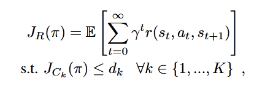  
 $J_{ij}$是机械臂约束  $d_{k}$是阈值  
 具体约束设计：  
 手臂关节扭矩约束     
 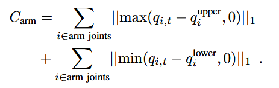  
 位置约束（末端执行器不能离base太远 空间有限）  
 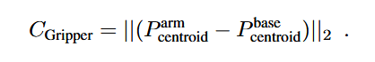   
 碰撞约束 （计算每个连杆受到的力）  
 
 ### P3O(PPO-惩罚)
 ### Reward-Aware Curriculum Learning 
 在训练中，没有采用常规的课程学习方式，在agent的初始化上改进，刚开始初始化接近目标姿势，慢慢扩大范围。  随着奖励越来越大，目标位置设置的范围也扩大。  
 优点：1.奖励稀疏函数  
 2.防止局部最优。手臂的工作空间大但奖励少，因此，手臂往往采取保守动作来避免影响到腿部的稳定，可以理解为在抗拒运动。通过这种方式刚开始就能获得较高奖励，减少对运动的抗拒。
 ## 结构 分段框架
 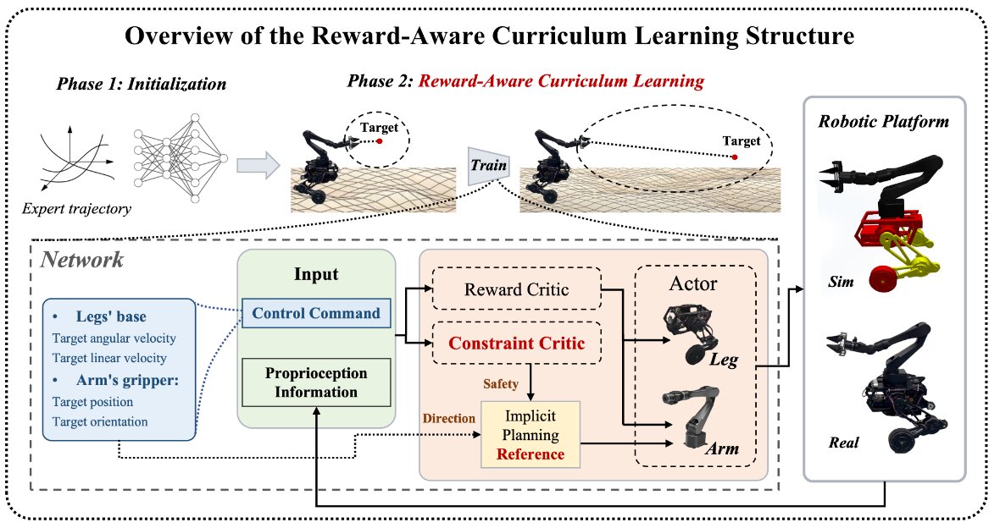
 上层：通过模仿学习与行为克隆训练一个目标网络 输出control command 包含底盘的线速度和角速度 以及arm的位姿  
 下层：AC_PPO 具体来说，将上层网络的输入与机器人的本体感觉作为输入 比传统PPO多了一个constraint critic  
 ### 实验
 硬件采用AIRBOT-两条腿的轮腿机器人 腿部各3电机 手臂六自由度+一个夹具
 ### 训练
 Observation Space：State $S_{t}$ ={$S_{t}^{base},S_{t}^{arm}$,$S_{t}^{cmd}$} ∈ $R^{46}$  
 $S_{t}^{base}$ ={h, v, w, R, $q_{leg}$, $\dot q_{leg}$, $\dot q_{wheel}$} ∈ $R^{20}$  
 $S_{t}^{arm}$ ={$q_{arm}$, $\dot q_{arm}$, $p_{ee}$, $R_{ee}$} ∈ $R^{18}$  
 $S_{t}^{cmd}$ ={$v_{x}^{cmd}$ , $w_{z}^{cmd}$ , $p_{ee}^{cmd}$ , $R_{ee}^{cmd}$} ∈ $R^{16}$  
 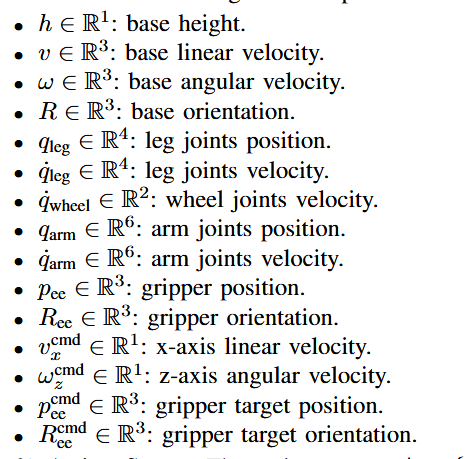  
 Action Space: Action A={$A_{leg}$, $A_{arm}$} ∈ $R^{12}$ 各位6个维度   
 benchmark:1.和不带Reward-Aware Curriculum Learning的比较  
 2.和不带constraint critic的比较
 ### tips
 1。代码只开源了下层 不知道上层模仿学习得到的轨迹好不好（文章中也没怎么提到）
# VBC(visual-whole-body-control)
reference:Visual Whole-Body Control for Legged Loco-Manipulation(CORL 2024 Oral)
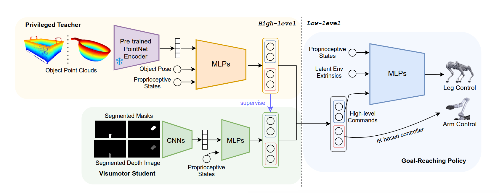 
分阶段训练 先下层通过采样 训一个track 速度的腿部控制器 胳膊的通过IK来算
再通过teacher-student 训一个上层规划器 输出9维度 6维度为arm关节 2维度为腿部目标速度 1维度为是否夹取
# LLM for quadruped 
llm修改奖励函数  
llm给出 每只脚什么时间与地面接触什么时间抬起  
llm加一些先验知识 给出目标电机位置
nvidia-smi
# AUTO_MOB
  
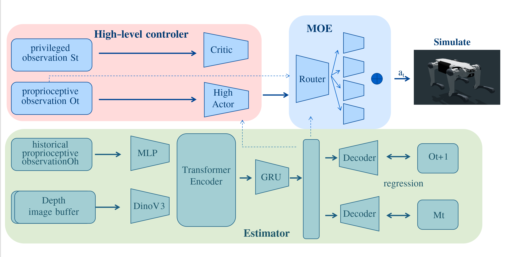

## Tricks in reinforce learining
### Improving Generalization in Visual Reinforcement Learning via Conflict-aware Gradient Agreement Augmentation
为了减轻在不同数据上训练的梯度冲突 提出了一种对梯度作优化的方式 一种数学优化方法

## Multi-critic Learning for Whole-body End-effector Twist Tracking
ETH teacherstudent框架 主要加了一个multi critic 把奖励分为三组  
就是对轨迹 命令进行采样 然后去跟踪 （task的创新点上不仅跟踪位姿 还额外注意了跟踪末端执行器的速度（twist））

# Legolas：Deep Leg-Inertial Odometry

- reference: Legolas: Deep Leg-Inertial Odometry（CoRL 2024）
- 作者单位：UIUC、CMU
- 任务类型：四足机器人本体感知里程计；不是 locomotion policy，也不是强化学习控制器
- 训练方式：Isaac Gym 中采集带位姿真值的数据，再做监督回归；zero-shot sim-to-real
- 真机：Unitree Go2、DEEP Robotics Lite3；室内和室外测试

## 一句话概括

Legolas 使用最近 1 秒的 IMU、关节状态、速度命令和关节动作历史，直接回归机器人在最近 0.02 秒内的 6-DoF 相对位姿变化，再逐帧积分成轨迹。训练标签全部来自 Isaac Gym/PhysX，不采集真机训练数据；真机上的 MoCap、RTK-GPS 或 LiDAR-SLAM 只用于测试和评价。

## 它解决的任务是什么

里程计需要回答的是：机器人相对上一时刻移动了多少，而不是机器人在世界中的绝对位置是多少。Legolas 在 50 Hz 下预测机体系下的增量运动：

$$
\Delta P_t=(\Delta x,\Delta y,\Delta z,\Delta R),
$$

其中平移是 3 维，旋转采用连续的 6D rotation representation。把每一步的 $SE(3)$ 增量连续相乘，就得到从任意初始原点出发的完整轨迹：

$$
P_t=P_0\Delta P_1\Delta P_2\cdots\Delta P_t.
$$

因此它属于 **relative odometry / state estimation**：

- 不输出 12 个电机目标，也不改变原有四足 locomotion controller。
- 不感知障碍物、不建图、不规划路径，也不直接完成导航任务。
- 它可向控制器或 SLAM 提供位姿增量；当视觉里程计因快速晃动、反光或光照变化丢失时，可作为不依赖视觉的运动先验。
- 单独使用时没有绝对位置观测和回环修正，所以长期积分漂移不可避免。

## 输入、输出和网络

每个时刻的观测为 44 维：

| 输入 | 维度 | 含义 |
|---|---:|---|
| IMU 陀螺仪 | 3 | 机体角速度 |
| IMU roll、pitch 估计 | 2 | 已经过机载 IMU 姿态算法处理的横滚和俯仰；并不是完全原始的 IMU 数据 |
| 速度命令 | 3 | $v_x^{cmd},v_y^{cmd},\omega_z^{cmd}$ |
| 12 个关节角 | 12 | 腿部本体状态 |
| 12 个关节速度 | 12 | 腿部本体状态 |
| 上一时刻的期望关节角动作 | 12 | locomotion policy 发出的控制目标，而非实测力矩 |

将最近 $H=50$ 帧堆叠，即输入 1 秒历史，预测最后 0.02 秒的运动。主干是 1D ResNet；部署版由 3 个 residual blocks 缩为 2 个，参数量由 4.7M 降为 1.5M。Go2 上按 50 Hz 使用，在 Jetson Orin Nano 上网络本身最高可运行约 600 Hz。

网络主要输出：

- 3 维平移增量；
- 6D 表示的旋转增量；
- 上述 9 个量各自的方差，用于表达异方差不确定性；
- 额外的 1 维 stationary/moving mask，用于零速度更新。

这里预测的是各分量方差，不能把它理解成含全部相关项的完整 $9\times9$ 协方差矩阵。

## 数据是怎么得到的

1. 在 Isaac Gym 中加载相应机器人的 URDF，并用一个在仿真和真机上都可执行的 robust locomotion policy 驱动机器人。
2. 数千个环境并行运行，地形包含平地、崎岖地面、绊倒物、斜坡和楼梯等。
3. 线速度命令从 $[-2,2]$ m/s 范围采样，yaw 角速度从 $[-\pi,\pi]$ rad/s 采样；还特意加入站立、原地旋转和直行数据。
4. PhysX 直接给出每一帧机器人的真实 $SE(3)$ pose，邻帧真值 $Q_{t-1}^{-1}Q_t$ 就是监督标签。
5. 采集 13.7M 个 Go2 样本，约等于 160 个机器人日的数据，实际并行采集约 48 小时。之后再给陀螺仪、roll/pitch、关节角和关节速度加入均匀噪声。
6. Go2 和 Lite3 的流程相同，但更换 URDF、locomotion policy 和数据集，分别训练模型；它不是一个模型直接通用于所有机器人。

论文列出了传感器加噪和地形多样化，但没有像典型 locomotion sim-to-real 工作那样清楚报告质量、惯量、电机、摩擦等系统性的 domain randomization。因此其迁移主要依赖大规模运动覆盖、传感器噪声以及 PhysX 与真机动力学足够接近。

## 损失函数与 zero-velocity update

训练目标不是比较整条累计轨迹，而是把每个时间步当作独立样本，比较预测增量 $\Delta P_t$ 与仿真真值增量 $\Delta Q_t$。这样不会让某一步的累计漂移反向影响后面的所有样本，也适合构造大规模离线监督数据集。

训练开始使用 MSE；稳定后改用 Gaussian maximum-likelihood loss：

$$
\mathcal L \sim \frac{1}{2}\log |\hat\Sigma_t|+
\frac{1}{2}e_t^T\hat\Sigma_t^{-1}e_t.
$$

网络既要预测运动，也要预测自己的不确定度：误差大而方差报得过小会被强烈惩罚，单纯把方差无限放大又会受到 $\log|\Sigma|$ 项惩罚。

只回归微小位移时，即使机器人静止，每帧极小的非零误差也会持续积分成漂移。作者因此加入 moving/stationary mask：预测静止时直接采用零位移；若把实际运动误判为静止，则以真实增量的大小惩罚它。这个机制主要消除 **站立阶段的伪运动漂移**，并不能消除机器人持续行走时的长期累计漂移。论文对 mask 的独立分类监督、连续门控还是硬阈值等实现细节写得不够充分，是复现时需要进一步检查代码的地方。

## 为什么只靠这些量能够估计位移

网络并不是从 IMU 做纯粹的两次积分。它学习的是特定机器人和步态控制器下的运动映射：

$$
(\text{速度命令},\text{上一动作},q,\dot q,\text{角速度},R_{rp})_{t-49:t}
\longrightarrow \Delta SE(3)_t.
$$

关节角和关节速度体现腿的实际响应，上一关节目标和速度命令体现控制器打算怎样运动，IMU 则提供机体旋转信息。网络在大量仿真数据中隐式学习腿运动与机体位移的对应关系，包括一定程度的滑移和崎岖地形效应。

这同时也是它最重要的限制：消融中删掉上一动作造成的退化最大，作者也明确承认，部署时若换成与训练不同的 locomotion policy，里程计会明显变差。换句话说，它并非真正 controller-agnostic 的通用状态估计器，而是与训练步态分布强耦合的 learned motion model。

## 实验与结果

### 真值如何获得

- 室内：主要用 motion capture；无法覆盖时用 LiDAR-SLAM。
- 室外：使用 RTK-GPS；GPS heading 不够准确，因此室外不报告 RPE@1m。
- 这些外部传感器只用于生成测试真值，不是 Legolas 部署输入。

主文测试了 11 个室内和 5 个室外场景；室内平均轨迹约 24 m，室外约 325 m，覆盖地毯、石材、楼梯、混凝土、泥土、草地和雨后湿滑地面。

### 对比方法

- EKF：基于 Cerberus 的解析腿—惯性滤波器，为 Go2 修改运动学模型并人工调参。
- BC：用 90,000 个真机样本训练、结构和损失与 Legolas 相同的行为克隆基线。
- VINS-Fusion：使用额外的双目图像和 IMU，并经过标定和调参，只成功用于室内比较。
- Ours w/ Go1：在 Go1 仿真数据上训练，再直接放到 Go2，测试跨相近机型迁移。

室内 RPE@1m：EKF 0.38、BC 0.81、Go1 模型迁移到 Go2 为 0.12、标准 Legolas 为 0.11、VINS-Fusion 为 0.09。作者据此报告，相比 EKF 的 relative pose error 降低约 73%，相比真机 BC 降低约 87.5%，并接近室内视觉惯性里程计。室外 VINS-Fusion 因强光、快速机体转动等问题未能稳定部署，Legolas 的累计轨迹误差优于 EKF 和 BC。

还在 Lite3 上完成了真机迁移，但 Lite3 结果主要是轨迹可视化，没有像 Go2 一样完整的量化基线比较。作者也展示了将 Legolas 的里程计和方差接入 RTAB-Map：视觉跟踪失效时，Legolas 提供运动先验使建图能够继续。

### 关键消融

完整输入的仿真验证 RPE@1m 为 0.05。删除任一输入都会变差：

- 去掉上一动作后，ATEo 增加约 484%，说明网络高度依赖控制器输出；
- 去掉关节本体感知后，ATEo 增加约 364%；
- 去掉 IMU 后，ATEo 增加约 258%；
- 只使用 IMU 时，ATEo 相比完整系统增加约 478%。

旋转表示也做了消融：6D rotation 的 RPE@1m 为 0.050，优于 $\log(SE(3))$ 的 0.085 和 Euler yaw-pitch-roll 的 0.233。网络从 4.7M 缩至 1.5M 参数后，RPE 略从 0.045 变为 0.050，但运行速度显著提高。

## 论文的真正贡献

1. 将四足 leg-inertial odometry 改写成大规模仿真监督学习问题，不再在估计器中显式写足端接触、无滑移假设和机器人运动学更新。
2. 证明只用仿真标签训练的相对位姿回归网络，可以 zero-shot 部署到两个真机平台，并在 Go2 上显著超过解析 EKF 与小规模真机监督基线。
3. 将上一动作和速度命令作为运动先验，与 IMU、关节历史联合估计，比 IMU-only learned odometry 更有效。
4. 输出运动相关的不确定度，并通过静止 mask 抑制站立时的积分漂移，便于接入 SLAM。

## 需要谨慎看待的地方

- **“纯数据驱动”有边界。** 它表示在线估计器中没有显式运动学、接触和滤波模型；但训练数据仍来自加载了 URDF、刚体动力学、摩擦模型和 locomotion policy 的 PhysX。物理先验只是被放进仿真器并隐式蒸馏到网络，而不是彻底消失。
- **不等于全局定位。** 无地图、GPS、视觉或 LiDAR 修正时，任意纯本体里程计都会累计漂移，Legolas 本身也没有回环或漂移消除机制。
- **策略依赖明显。** 上一动作是最重要输入，而且论文承认换步态策略会失败；对新 gait、受损电机、负载变化和剧烈滑移的泛化仍不充分。
- **跨机器人泛化被标题容易夸大。** Go2 与 Lite3 使用各自的数据和各自模型；Go1→Go2 只证明了相近四足平台间有一定迁移能力，并非一个 universal embodiment model。
- **BC 对比并不完全隔离“仿真 vs 真机”的因素。** BC 只有 90k 样本，而 Legolas 有 13.7M 样本，约相差 152 倍；优势同时来自数据规模、地形覆盖和仿真标签，不应只归因于仿真训练方式。
- **视觉比较不是同一传感器条件。** VINS-Fusion 多用了双目相机；它室内略好，室外失败说明两者更适合互补，而不能简单得出 learned proprioceptive odometry 全面超过视觉里程计。
- **仿真限制仍存在。** 作者列出的限制包括简化足地接触、有限的传感器模型和没有动态障碍；真机 Lite3 量化也不充分。

## 对四足 RL 感知控制的启发

Legolas 最合适的定位不是替代 RL locomotion，而是作为其旁路 state estimator：

```text
IMU + joint state + command/action history
                    ↓
              Legolas odometry
                    ↓
      local pose / velocity prior + uncertainty
          ↙                         ↘
   visual/LiDAR SLAM          navigation/controller
```

对端到端视觉导航，比较值得借鉴的方向是把相对位姿预测作为 auxiliary task，或在视觉暂时失效时根据预测方差切换到本体里程计。但若控制策略持续在线变化，不能直接照搬固定 policy 下的训练数据；需要把 gait/policy variation、质量负载、足地摩擦和 actuator fault 加入训练分布，或者联合训练 locomotion policy 与 odometry encoder。

### 最终判断

这是一篇 **状态估计 / sim-to-real supervised learning** 论文，不是 RL 运控论文。其亮点是用大规模仿真数据获得了实际可用的无视觉四足里程计；最关键的学术风险则是对动作和既定 locomotion policy 的强依赖。它适合当作视觉惯性系统的 fallback 或融合因子，但不能单独承担长期全局定位、建图和导航。
